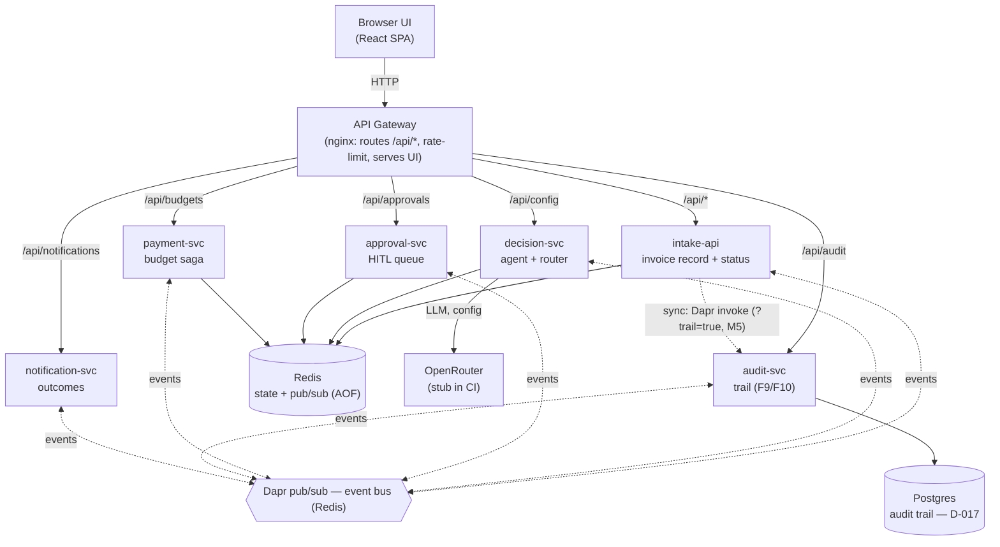
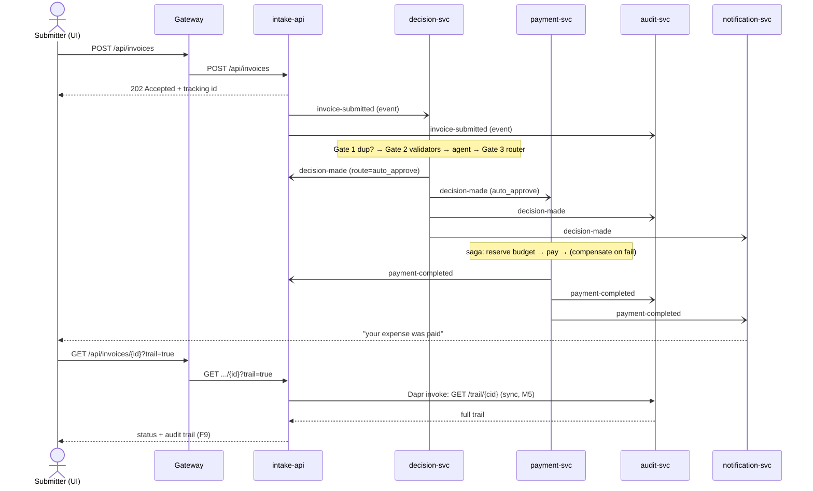
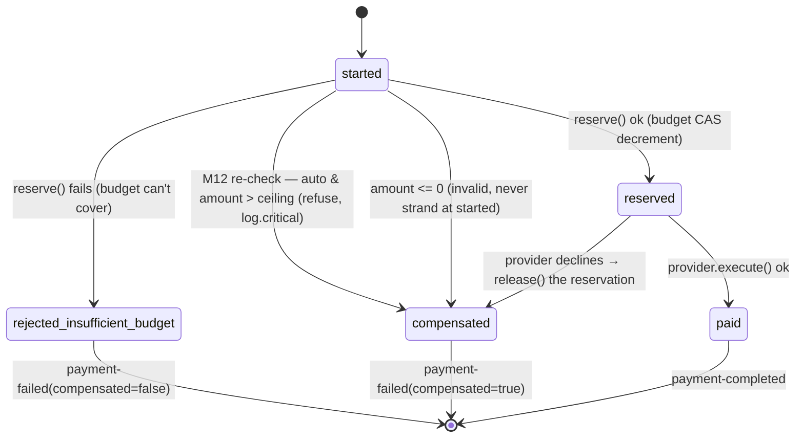

# ApprovalFlow — Architecture

> Design and component boundaries, decided before code and captured here (D1).
> The reasoning behind each choice lives in [`decisions.md`](decisions.md) (D-001…D-017);
> the hand-written ADRs (D2) live in `docs/adr/`.

## 1. Overview

ApprovalFlow is a microservice, AI-assisted invoice/expense approval platform. It ingests
invoices asynchronously, has an AI agent judge each against a company policy, and
**auto-approves the low-risk majority** while **escalating the risky/unclear/high-value minority
to a human**. Approved items run through a payment saga with compensation; every decision is
auditable end-to-end by one correlation id.

The load-bearing idea: **the agent only recommends; a deterministic router decides.** The agent's
opinion can make an outcome _more_ cautious but is structurally incapable of moving money past a
guard — which is what makes the autonomy ceiling provable (M12).

Six services, each owning one bounded context and its own state, communicating through Dapr —
asynchronously (pub/sub) for the flow and synchronously (service invocation) for exactly one call.

## 2. Component diagram

Solid edges are synchronous HTTP; dotted edges are asynchronous events. Every service runs beside
a Dapr sidecar; state, pub/sub, secrets, and service invocation all go through Dapr, so the
backing stores (Redis, Postgres) are swappable by component YAML, not code.

## 3. The event catalog

Five topics carry the whole flow (CloudEvents over Dapr/Redis; every payload carries `invoiceId`,
`correlationId`, `eventId`):

| Event | Publisher → consumers |
|---|---|
| `invoice-submitted` | intake → decision, audit |
| `decision-made` | decision → approval (human_review), payment (auto_approve), intake, audit, notification |
| `approval-resolved` | approval → payment (approved), intake, audit, notification |
| `payment-completed` | payment → intake, audit, notification, decision (trust history) |
| `payment-failed` | payment → intake, audit, notification |

## 4. Sequence — the life of an invoice (happy path)

For an escalated item, `decision-made(human_review)` goes to **approval-svc** instead, which
persists a durable escalation record (the pause **is** a record — it survives a service restart,
M11); a human's verdict publishes `approval-resolved`, and payment picks up from there.

## 5. Payment saga & compensation (D-014)

The money path is a persisted-step saga: each step is written to `saga:{invoiceId}` **before** its
effect, so a crash resumes from the marker rather than re-doing or losing work. Every step that
moves money has an undo.

Key guarantees:
- **No overspend** — budget reservation is an ETag compare-and-swap loop; two concurrent
  approvals against one budget can never both succeed (INV-1014A/B proves it: exactly one of two
  $600 claims pays from a $1,000 budget, never negative).
- **No orphaned reservation** — a declined payment releases the exact amount it reserved
  (journey D: INV-1012 fails, the engineering budget returns to its prior value).
- **No double pay** — provider execution is idempotent by `invoiceId`; the saga's terminal-record
  check makes a redelivered/duplicate trigger a no-op; duplicate submissions are caught upstream by
  the fingerprint gate (INV-1007).
- **M12 defense-in-depth** — payment independently re-checks the ceiling for auto-routed items;
  two services would have to be wrong for money to move past the ceiling.

## 6. The dilemma — autonomy posture (D-012)

The agent may auto-approve **only if all** hold; otherwise a human decides.

| Guard | Rule |
|---|---|
| Amount ceiling | ≤ **$250**, or ≤ **$400** for a vendor+category this system has already paid successfully (trust earned from our own payment history) |
| Category caps | SaaS ≤ $200/mo · meals ≤ $75/attendee (the effective ceiling is `min(base, cap)`) |
| Confidence | agent confidence ≥ **0.80** |
| Hard stops (any forces a human) | new/unknown vendor, foreign-currency stop, math mismatch, fraud signals, missing receipt/info |

The router is a pure function enforcing this; the agent's recommendation is one input it can only
use to be _more_ cautious. See [`decisions.md` D-012](decisions.md) and (once written)
`docs/PRODUCT-DILEMMA.md` for the trade-off justification and fixture evidence.

## 7. Cross-cutting concerns

- **Correlation-id tracing (M14):** minted once at intake, stamped on every event and every
  structured (JSON) log line across all services, so one request is followable end-to-end. The
  audit trail (F9) is keyed by it; `?trail=true` composes the full timeline.
- **Idempotency (M10):** three layers — duplicate submissions (fingerprint gate, D-011),
  redelivered events (per-consumer `processed:{eventId}` dedupe, shared afcommon helper D-016),
  retried payments (saga marker + provider key).
- **Provable ceiling (M12):** enforced by the deterministic router, proven by an adversarial test
  suite that runs every fixture through the gates with a malicious always-approve agent — no
  non-auto label flips. Plus payment's independent re-check.
- **Fail loud (M15):** an LLM provider failure escalates to a human (`AGENT-UNAVAILABLE`), never a
  silent pass or a blind approval; the provider is swappable behind the `DecisionAgent` port
  (handrolled / stub / optional MAF), selected by config.
- **Two state stores (D-017):** operational state on Redis (with AOF); the immutable audit trail on
  Postgres — different data with different durability/retention needs, the same afcommon
  `DaprStateStore` class pointed at a different component.

## 8. Scaling path ("assume millions of users")

Every scaled-down demo choice is a component swap, not a redesign — which is the point of routing
everything through Dapr:

| Demo | At scale | Cost of swap |
|---|---|---|
| Single Redis (state + broker) | Redis Cluster / Kafka | Dapr component YAML — no code |
| Postgres single node | managed/replicated Postgres | connection string |
| `docker compose` | Kubernetes + autoscaling | manifests, same images (B3 path) |
| Single nginx | managed load balancer | config |
| Budget CAS on one key | partition by department | keying, per-budget contention only |

The real bottleneck is LLM throughput — behind a queue, so decision-svc workers scale
independently; the agent only recommends (a cheaper model is acceptable), and duplicates never
reach it. Stateless services (all state in Dapr) make horizontal scaling trivial.

**Honest residuals** (documented, not hidden): the payment saga has a bounded crash/concurrency
window that fails _safe_ (budget under-credit, never overspend or double-pay — see `saga.py` and
[`decisions.md`]); M12's adversarial proof is 19/20 fixtures because one rule (alcohol-only,
MEAL-03) is agent-semantic with no deterministic backstop — bounded by the ceiling, documented in
`decisions.md`.

## 9. Requirement → where it lives

| Req | Where |
|---|---|
| F1/M8 async intake | intake-api `POST /api/invoices` → 202 + async pipeline |
| F2 status + reason | intake `GET /api/invoices/{id}`; agent plain-language reasoning |
| F3/M10 no double-pay | fingerprint gate (decision) + saga idempotency (payment) |
| F4/F5/M11 HITL | approval-svc queue + durable pause/resume (restart-proven) |
| F6 no rubber-stamping | D-012 posture keeps autonomy meaningful |
| F7/M13 configurable | decision-svc thresholds in Dapr state, `PUT /api/config/thresholds` |
| F8 dashboard | intake counters, UI Dashboard tab |
| F9/F10 audit | audit-svc trail + ceiling-compliance |
| M3/M4 | 6 services, one `docker compose up` |
| M5 | Dapr pub/sub + state + secrets + one sync invocation (intake→audit) |
| M6/M7 | nginx gateway + React SPA |
| M9 | payment saga + compensation |
| M12 | router + adversarial suite + payment re-check |
| M14/M15 | afcommon JSON logging + correlation id; fail-loud provider ACL |
| M16/M17 | GitHub Actions CI: ruff + pytest + image build |
| M18/D1 | README + this file |
| D5 | `make verify` — four journeys + anti-cheese guards |
