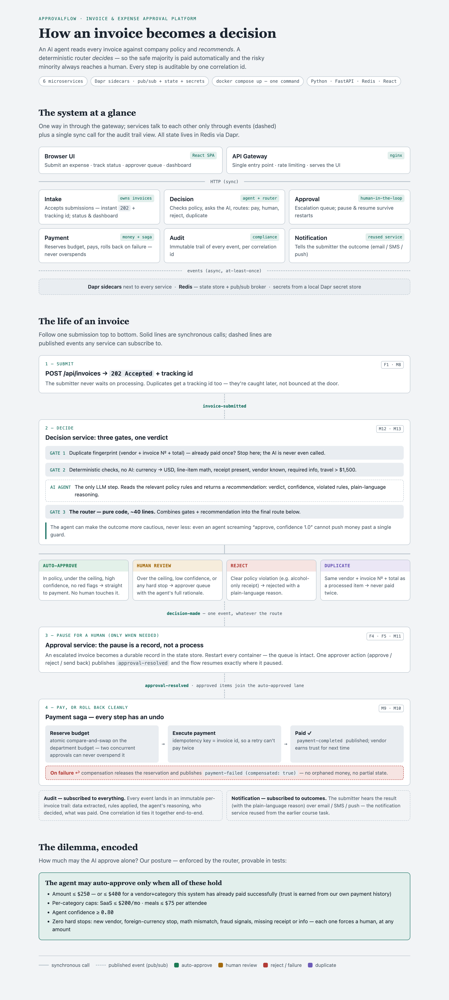
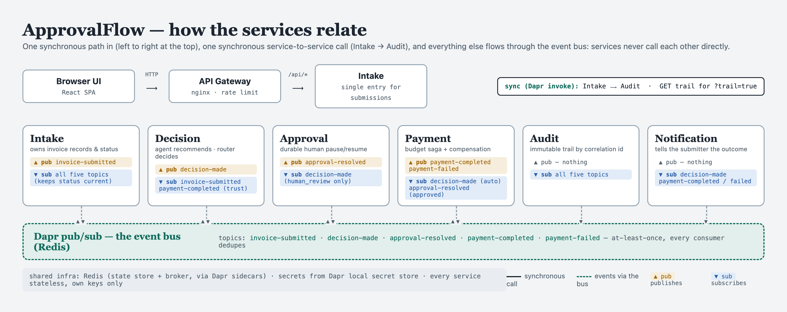
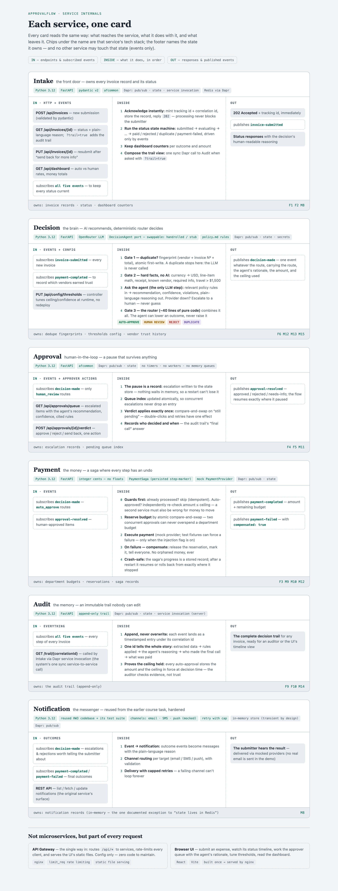

# ApprovalFlow — Invoice & Expense Approval Platform

AI-assisted, microservice invoice/expense approval (course capstone). WIP.
Design: `docs/superpowers/specs/2026-07-03-approvalflow-design.md` · Decisions: `decisions.md`.

## System map



Interactive version (light/dark themes): open [`docs/system-map.html`](docs/system-map.html) in a browser.

## Service relations

Who talks to whom: one synchronous path in, one sync service-to-service call (Intake → Audit), everything else over the event bus:



## Service internals

Each service on one card — what comes **in**, what happens **inside**, what goes **out**, with its tech stack and the state it owns:



Interactive version: open [`docs/service-maps.html`](docs/service-maps.html) in a browser.

## Run

```
docker compose up --build
```

### Use the app

Open **http://localhost:8080** — the nginx gateway is the single entry point (M6): it serves the React UI and proxies `/api/*` to the services, so this one port drives the whole system.

The UI (M7) has six tabs:
- **Submit** — prefill from any shipped fixture (INV-1001…INV-1019) and submit; get a tracking id back instantly.
- **Status** — watch an invoice reach its decision, expand its audit trail (F9), and resubmit after a send-back (F5).
- **Approver queue** — the escalated items only, each with the agent's recommendation, confidence, and cited rules; approve / reject / send back (F4/F5).
- **Dashboard** — throughput, auto-vs-human rates, money moved (F8).
- **Thresholds** — tune the autonomy policy at runtime, no redeploy (F7).
- **Compliance** — prove no auto-approval ever exceeded its ceiling (F10).

A quick demo: Submit → pick `INV-1001` → Submit (auto-approves → paid); pick `INV-1003` → Submit (escalates) → Approver queue → Approve.

### Try it via curl (per-service ports, for debugging)

The gateway is the real entry point; the per-service host ports below are for debugging.

Submit an invoice:

Submit an invoice:
```
curl -X POST http://localhost:8001/api/invoices \
  -H 'Content-Type: application/json' \
  -d '{"id":"INV-1001","submitter":"dana.cohen@northwind.example","department":"engineering-2026Q2","vendor":"Bistro 19","vendorKnown":true,"invoiceNumber":"NW-INV-7781","currency":"USD","category":"meals","attendees":1,"lineItems":[{"description":"Team lunch","quantity":1,"unitPrice":38.89}],"taxAmount":3.11,"total":42.0,"receiptPresent":true,"date":"2026-05-12","notes":"smoke"}'
```

Check status (replace `<trackingId>` with the ID from the response):
```
curl http://localhost:8001/api/invoices/<trackingId>
```

View dashboard:
```
curl http://localhost:8001/api/dashboard
```

#### Decision service

View runtime thresholds (port 8002):
```
curl http://localhost:8002/api/config/thresholds
```

Tune thresholds at runtime without redeploy:
```
curl -X PUT http://localhost:8002/api/config/thresholds \
  -H 'Content-Type: application/json' \
  -d '{"ceiling_cents": 30000}'
```

Within seconds after submitting an invoice, the decision service routes it: `approved` (auto-approved) or `pending_approval` (escalated). A resubmission of the same payload routes `duplicate`.

#### Approval service

View escalation queue (port 8003):
```
curl http://localhost:8003/api/approvals/queue
```

Submit approval verdict:
```
curl -X POST http://localhost:8003/api/approvals/<trackingId>/verdict \
  -H 'Content-Type: application/json' \
  -d '{"verdict":"approved","approver_id":"you@example.com","comment":"ok"}'
```

Escalated invoices (e.g., client dinners over $500 without a client name) pause in the queue durably — the compose smoke proves the pause survives a service restart (requirement M11, journey B).

#### Payment service

Check remaining budget (port 8004):
```
curl http://localhost:8004/api/budgets/engineering-2026Q2
```

Approved invoices flow to the payment saga which reserves department budget, pays (via mock provider), and compensates on failure. The compose smoke proves journey A (auto-approve → paid), journey D (INV-1012 injected failure → budget reservation released, no orphan), and INV-1014A/B (two $600 claims against a $1000 budget → exactly one pays, no overspend).

#### Audit service

Every event lands in an immutable, per-correlation-id trail on a **Postgres**-backed state store. Two auditor queries:

```
# F9 — the full decision trail for any invoice, via intake (which fetches it
# from audit-svc through a Dapr service-invocation call — the one sync call, M5):
curl "http://localhost:8001/api/invoices/<trackingId>?trail=true"

# F10 — prove no auto-approval ever exceeded its ceiling (an empty violations
# list over a non-zero checked count IS the proof):
curl http://localhost:8005/audit/ceiling-compliance
```

#### Notification service

Reused from the earlier screening task (its SMS-segmentation logic and tests come along unchanged) behind a Dapr subscriber. It turns outcome events into submitter-facing notifications delivered via mock email/SMS/push providers:

```
curl http://localhost:8006/notifications
```

## Test

```
pip install -r requirements-dev.txt -e libs/afcommon
pytest
```
